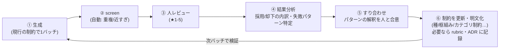

# お題 生成基準の校正ループ（メタプロセス）

このプロジェクトの**本体**。`odai-generation-flow.md` が「1バッチを流す内側のパイプライン（道具）」なら、こちらは「**その生成基準を人のレビューから逐次育てる外側のループ**」。良いお題の基準は事前に決まらず、回しながら明文化して締めていく。

## なぜこれが重要か
- 「良いお題」は言語化が難しく、事前の定義では当たらない（実際 v1〜v4 で基準が二転三転した）。
- 人のレビュー（★1-5）に現れる**失敗パターン**を観測し、生成の制約として**明文化**して初めて前進する。
- 各調整は1つの失敗を潰すと別の失敗を表に出す（例: 機能アナロジー↔近すぎ）。＝**狭い帯を反復で詰める営み**。一発で決まらない前提で回す。

## ループ

## 各ステップ
1. **生成**: 現行の制約（種プール・co-member 框組み・カテゴリ制約・few-shot）で1バッチ作る。
2. **screen**: 自動で重複と近すぎ（距離）を排除（`/api/screen`）。
3. **人レビュー**: 通過分を `/review` で ★1-5。＝唯一の真値（ADR 0001/0002）。
4. **結果分析（Claude）**: 採用率と評点分布、**却下の失敗パターン**を特定（例: 抽象種 / 機能・形アナロジー / 同サブカテゴリの近すぎ / 曖昧・架空カテゴリ）。
5. **すり合わせ（人＋Claude）**: 「なぜ良くなかったか」の解釈を人と合意する。ここがズレると次の調整が外れる。
6. **制約の更新・明文化（Claude）**: 合意した線引きを生成の制約として書き下す（プロンプト・種プール）。一般則になるものは rubric / ADR に記録。
7. → 1へ。次バッチで効果を検証。

## 担当
- **人**: ★評価（真値）と、質的な線引きの**合意**（⑤）。「何が良い/悪いか」の最終判断者。
- **Claude**: パターン分析（④）、制約の言語化・実装（⑥）、関係タイプ付与。
- 将来は③の評価者を LLM に差し替え＝ループの自走（ADR の LLM-only 方針）。今は人。

## 蓄積物（このループの成果が貯まる先）
- **ルーブリック**（`odai-rubric-v*.md`）: 「良いお題」の基準の版管理。
- **ADR**（`adr/`）: 構造的決定（評価の集約 fold / QD→種ベース / 等）。
- **生成制約の系譜**（下記）。
- **DB の評価データ**: 採用/却下＋関係タイプ＝few-shot と次の分析の素材。

## これまでの調整の系譜（このループの実績）
- ルーブリック: v1(4語・広いテーマ) → v2(ペア・距離説) → v3(距離棄却・共通点の質) → v4(具体カテゴリ・非自明・非予測)。
- 生成: LLM自由生成 → QD(exploit/explore, 退役) → 種ベース → 種を片側にアンカー → 種を具体名詞に限定 → co-member 框組み → カテゴリを「名詞の種類」に限定（機能/形/架空で括らない）。
- 各段は「前バッチの失敗パターン」への応答。例: 抽象ペア多発→具体名詞種、連想/同義多発→co-member、機能アナロジー多発→名詞カテゴリ制約。

## 既知のトレードオフ（回す上での注意）
- 制約を締めると**機能アナロジー↔近すぎ**を行き来する（狭い帯）。
- 距離ガードレール（bge-m3）は意味的な近すぎ（醤油×味噌等）を取りこぼす＝近すぎ排除を距離だけに頼れない。
- 自己評価（生成LLM）は自分の機能アナロジー/比喩を甘く付ける＝過信しない。
