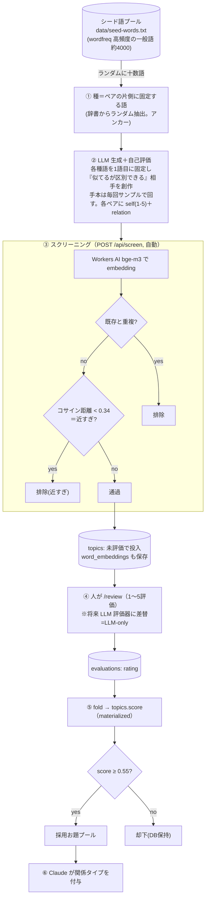

# お題 生成→評価ループ 全体像

種ベースの簡素フロー（ADR 0004。旧 QD 機構は退役）。

## 考え方（なぜ種を“片側に固定”するか）
- LLM 単独生成は typicality bias で同じ鉄板ペアに偏る（mode collapse）。
- 当初は種を「任意の発想のきっかけ（関連不要）」にしたが、**任意にすると種が出力を全く拘束せず無力化し、LLM はいつもの mode に戻って“見たような組合せ”を繰り返した**（実測）。
- 対策: **種をペアの片側に固定（アンカー）**。ランダムな種語が必ず1語目に入るので、毎回違う場所から発想が始まり mode を抜ける。種の“引き”こそが多様性の源で、「引っ張られない」とは両立しない。
- あわせて**手本(few-shot)を固定せず毎回サンプルで回す**（固定の良い例が mode を固定するため）。
- 多様性は種のランダム性で、品質は LLM の生成＋自己評価＋screen＋人レビューで担保。**生成時点で精度を気負わない**。

## 凡例（実装との対応）
- ①シード: `data/seed-words.txt`（wordfreq 高頻度・漢字/カナ2-6字 約4000）からランダム抽出。
- ②生成: Claude が sub-agent で実行。各種語を1語目に固定して相手を創作＋自己評価（self/relation）。手本は採用済みからランダム数件を毎回サンプル。自己評価は弱い signal（過信しない）。
- ③`/api/screen`: 重複＋近すぎ（距離 `NEAR_THRESHOLD=0.34`、bge-m3）を自動排除。
- ④⑤fold: ADR 0001/0002。`score` は evaluations の畳み込み（将来 LLM/ユーザー評価者が増える前提の重み付け。今は人単独）。
- ⑥関係タイプ付与＝Claude。被覆は cockpit で確認（多様性の目安）。

## 退役したもの（ADR 0003 の QD 機構）
exploit/explore のモード分け、QD アーカイブのセル（PICK/ELITE）、elites-few-shot、被覆ドリブン生成は**退役**。hit-rate を上げず複雑なだけだった。多様性は「アーカイブ被覆」でなく「**種のランダム性**」で出す（ADR 0004）。QD の“多様性を目的に置く”精神は被覆ビューで残る。

## 現状の弱点
③は距離での「近すぎ」しか自動排除できず、機能アナロジー/自明 co-hyponym/比喩は④（人）まで素通り＝採用率の律速。将来 ③に「LLM 粗フィルタ」を足す余地あり（ただし自己評価が甘い実績があるので過信しない）。
