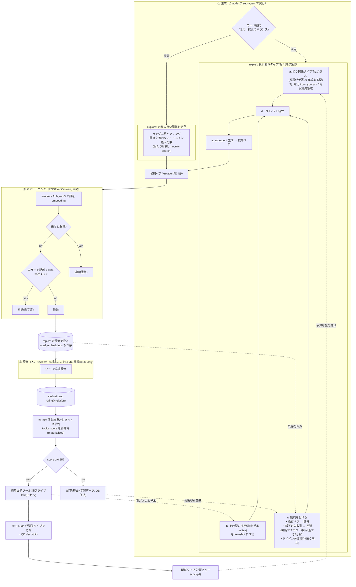

# お題 生成→評価ループ 全体像

現在の生成・評価フロー（Quality-Diversity, ADR 0001/0002/0003）。

## exploit の構造（QD のセル充填）
exploit は「良いと分かっている**関係タイプ（＝QD のセル）を1つ選び、そのセルを深掘りする**」操作:
1. **狙う型を選ぶ (PICK)**: 被覆ビューで手薄な型、または実績ある型を選択。
2. **お手本を集める (ELITE)**: その型の採用済みペアを few-shot 種にする（＝そのセルの elites）。
3. **制約 (CONS)**: 既存ペアを除外、却下の失敗型を回避、ドメイン分散。
4. **組立→生成 (PROMPT/AGENTX)**: 上記を1つのプロンプトにまとめ sub-agent で新メンバーを生む。

ポイント: **型ごとに elites を種に新メンバーを増やす**ので、良い関係を保ちつつ同じセルを濃くできる。被覆が偏らないよう PICK で手薄なセルを優先するのが QD の肝。

## 凡例（実装との対応）
- ②`/api/screen`: 距離ガードレール（`NEAR_THRESHOLD=0.34`）＋重複排除。距離は M2（bge-m3, ベクトルは JSON text 保存）。
- ③`/review`: 人の高速評価。ここを LLM 評価器に差し替えると LLM-only（最終目標、今は人）。
- ④fold: ADR 0001/0002。`score` は evaluations の畳み込み（materialized・派生）。**人/LLM/ユーザーなど評価者が将来増える前提**の信頼度重み付け（単独評価の今はその縮退形。詳細・将来仕様は ADR 0001/0002）。
- ⑤関係タイプ付与＝Claude の担当。被覆＝QD（ADR 0003）の多様性軸。
- 点線4本が exploit の入力＝ループの学習（被覆→型選択 / 採用→お手本 / 却下→回避 / 既存→除外）。

## 現状の弱点（律速）
②は距離での「近すぎ」しか自動排除できず、機能アナロジー/自明 co-hyponym は③（人）まで素通り＝採用率の律速。将来 ②に「LLM 粗フィルタ」を足すと人の負荷が下がる。

注: 現状の実装は exploit を毎回フルには回しておらず、PICK/ELITE を Claude が手動で組み立てている段階。型ごとの elites 自動収集・被覆ドリブンの PICK は今後の自動化対象。
